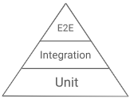
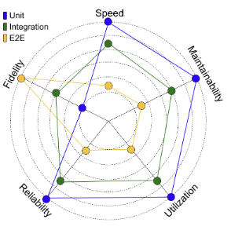

# Testing 🧪

The test pyramid is the canonical heuristic (authoritative rule-of-thumb 👍) for guiding test suite evolution. It conveys a simple message - *prefer more unit tests than integration tests, and prefer more integration tests than end-to-end tests.*

*Fig: Test Pyramid*

The SMURF 👲 mnemonic is an esay way to remember the tradeoffs to consider when balancing your test suite:

1. Speed
2. Maintainability
3. Utilization
4. Reliability
5. Fidelity

*Fig: A radar chart of Test Type vs. Test Property (i.e. SMURF). Farther from center is better.*

In many cases, the relationships between the SMURF dimensions are in tension: improving one dimension can affect the others. However, if you can improve one or more dimensions of a test without harming the others, then you should do so.

- **Speed 🚄**: Unit tests are faster than other test types and can be run more often --you'll catch problems sooner.
- **Maintainability ⛏️**: The aggregated cost of debugging and maintaining tests (of all types) adds up quickly.
- **Utilization 🤑**: Tests that use fewer resources (memory, disk, CPU) cost less to run.
- **Reliability 😅**: Reliable tests only fail when an actual problem has been discovered.

## 5. Fidelity 😇

The fidelity of a test refers to how closely the behavior of the test resembles the behavior of the production code.
A test with higher fidelity gives you higher confidence that your code will work properly.

When specifying a dependency to use in a test, prefer the highest-fidelity option. 

1. Try to use the real implementation
2. Use a fake if you can't use the real implementation.
3. Use a mock if you can't use the real implementation or a fake.

Sometimes you can't use a real dependency in a test (e.g. if it's too slow or talks over the network), but there may better options than using mocks, such as a **hermetic local server** (e.g. a credit card server that you start up on your machine specifically for the test) or a **fake implementation** (e.g. an in-memory credit card server).

**Hermetic Server 🦬**

A hermetic server is a self-contained server environment that is completely isolated and independent from external dependencies or resources. The term "hermetic" comes from the concept of being airtight or sealed off from outside influences.

Key characteristics:
1. Deterministic Behavior
2. Self-contained
3. Isolaution: No external network calls or dependencies are required during runtime.
4. Reproducibility

## References

1. [Google ToT](https://testing.googleblog.com/search/label/TotT)