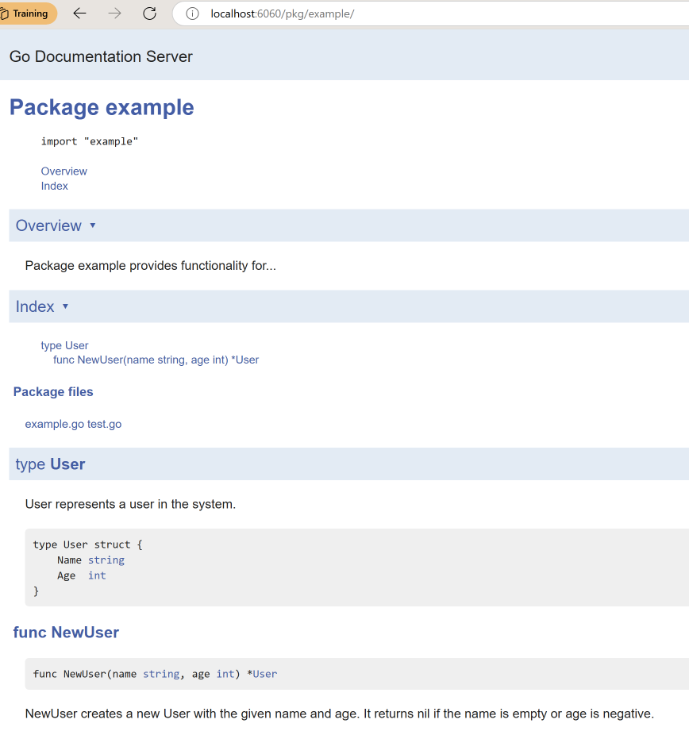

# Style Guide

Go style guide by Google - [Go Style Guide](https://google.github.io/styleguide/go/guide)

# How to use Go:

Effective Go - [Effective Go](https://go.dev/doc/effective_go)

# Godoc Server 🩻

Godoc is a documentation tool for Go that generates and serves documentation for Go packages. The godoc server allows you to browse documentation for your Go code locally, similar to how you can browse standard library documentation on pkg.go.dev.

To start using godoc, follow given steps:

1. Install godoc (if you haven't already) using `go install golang.org/x/tools/cmd/godoc@latest`
2. Run the godoc server using `godoc -http=:6060`

This will start a local server on port 6060. You can then access your documentation by opening a web browser and navigating to `localhost:6060/pkg`. Note, `go.mod` file should be present in your package to be shown in godoc server. 

### Key features of godoc server 🤪

- Shows documentation for your local packages
- Provides a search functionality
- Displays example code from your tests
- Shows package dependencies
- Renders formatted documentation from your Go source code comments

Best practices for writing godoc-friendly documentation:

```go
// Package example provides functionality for...
package example

// User represents a user in the system.
type User struct {
    Name string
    Age  int
}

// NewUser creates a new User with the given name and age.
// It returns nil if the name is empty or age is negative.
func NewUser(name string, age int) *User {
    if name == "" || age < 0 {
        return nil
    }
    return &User{
        Name: name,
        Age:  age,
    }
}
```

The comments you write in your code will be rendered as documentation by godoc, making it an essential tool for Go developers working on packages that will be used by others.



*Fig: example pkg in godoc server*

# Installing Golang 🦦

First, install the latest version of Golang from their official site [latest](https://go.dev/dl/).

After downloading follow the below steps: 🪜

1. **Remove any previous Go installation 🧓🏽** by deleting the /usr/local/go folder (if it exists), then extract the archive you just downloaded into /usr/local, creating a fresh Go tree in /usr/local/go:

    `rm -rf /usr/local/go && tar -C /usr/local -xzf go1.23.3.linux-amd64.tar.gz`

    (You may need to run the command as root or through sudo).

    **Do not** untar the archive into an existing /usr/local/go tree. This is known to produce broken Go installations.

2. Add ➕ /usr/local/go/bin to the PATH environment variable.
    You can do this by adding the following line to your $HOME/.profile or /etc/profile (for a system-wide installation):

    `export PATH=$PATH:/usr/local/go/bin:~/go/bin`


3. Verify 🖊️ that you've installed Go by opening a command prompt and typing the following command: `go version`

    Confirm that the command prints the installed version of Go.

After the above procedure, you will have 2 go folders. 📁

1. `/usr/local/go` - This is the Go installation directory (GOROOT)
    - This contains the Go compiler, standard library and tools.
    - This is created when you extract the Go binary distribution

2. `~/go` - This is your Go workspace (GOPATH)
    - This is the default location for your Go projects and dependencies.
    - It's automatically created when you start using Go
    - Typically contains three subdirectories:
        - `src` for souce code
        - `pkg` for compiled package objects
        - `bin` for compiled executables

Both directories serve different purposes and are needed for Go development. The `/usr/local/go` is where the Go toolchain lives, while `$/go` is where your projects and third-party packages will be stored by default.

# Go Module 🦸🏽‍♂️

A Go module is a collection of related Go packages that are versioned together as a single unit. It includes:

- A collection of Go source files in a directory 📁
- A go.mod file at the root 🫚
- Defines the module's properties, dependencies, and versioning
- Enables dependency management and versioning

### `go.mod` file ☝🏽

The primary module definition file that contains important metadata about your project including:

- Declares the module path (module name)
- Lists all direct and indirect dependencies
- Specifies the Go version being used
- Controls dependency versions

### `go.sum` file 🥸

A verification file that:

- Contains cryptographic hashes of module dependencies
- Ensures reproducible builds
- Verifies integrity of each dependency

Important commands:

```bash
go mod init     # Initialize a new module
go mod tidy     # Add missing and remove unused dependencies
go mod verify   # Verify dependencies
go mod download # Download modules to local cache
```