# How to Use Golang

Capture in Notion. Then organize here since related to this project. 

# Few confusing things 😕

### Function Literals (Anonymous Functions) 🚯

Function literals are functions without names that can be assigned to variables or passed as arguments. They can access variables from the enclosing function (closure).

```go
// Example of a function literal
square := func(x int) int {
    return x * x
}
result := square(5) // Returns 25
```

### Closures 🔐

Closures are function literals that can reference variables from their enclosing scope, even after the outer function returns.

```go
func counter() func() int {
    count := 0
    return func() int {
        count++
        return count
    }
}
// count maintains its value between calls
```

### Serial and Parallel Consistency 🏗️

Serial consistency (also known as sequential consistency) means that operations appear to execute in the order specified in the program, while parallel consistency deals with how concurrent operations are ordered across multiple goroutines.

**Serial Consistency ⛎**

- Operations within a single goroutine are always serially consistent
- The program executes instructions in the order they appear in the code
- Reads and writes in the same goroutine maintain their program order

**Parallel Consistency 🈂️**

- Deals with ordering of operations across multiple concurrent goroutines
- Go provides sync primitives (mutexes, channels) to maintain consistency
- Without proper synchronization, parallel operations may have race conditions

Example using channels for consistency (parallel):

```go
ch := make(chan int)
go func() {
    // Operations in goroutine 1
    x := 42
    ch <- x // Ensures operation ordering
}()
// Operations in main goroutine
val := <-ch // Guarantees consistent view of x
```

Example using mutex for consistency:

```go
var mu sync.Mutex
var count int

func increment() {
    mu.Lock()
    count++ // Protected access ensures consistency
    mu.Unlock()
}
```

This is how you can handle concurrent operations to achieve parallel consistency. 

## Golang Goroutines vs JS Async Functions

Let's clear our understanding related to Golang Goroutines and JS Async funcitons.

| **Feature** | **Go Goroutines 🚀** | **JavaScript Async Functions ⚡** |
| --- | --- | --- |
| Execution Model | True concurrent threads | Single-threaded event loop |
| Parallelism | Real parallel execution across CPU cores | Non-blocking but sequential execution |
| Memory Model | Shared memory with channel communication | Promise-based with async/await |
| Resource Usage | Lightweight (2-4KB per goroutine) | Heavier promise overhead |
| Error Handling | Explicit error returns | Try/catch with promise rejection |

Here are practical examples showing the difference 🔍:

```go
// Go Example - Concurrent HTTP Requests 🌐
func fetchURLs(urls []string) []string {
    results := make(chan string, len(urls))
    for _, url := range urls {
        go func(url string) {
            resp, _ := http.Get(url)
            defer resp.Body.Close()
            body, _ := ioutil.ReadAll(resp.Body)
            results <- string(body)
        }(url)
    }
    
    var responses []string
    for i := 0; i < len(urls); i++ {
        responses = append(responses, <-results)
    }
    return responses
}
```

```jsx
// JavaScript Example - Async HTTP Requests
async function fetchURLs(urls) {
    try {
        const promises = urls.map(url => 
            fetch(url).then(response => response.text())
        );
        const responses = await Promise.all(promises);
        return responses;
    } catch (error) {
        console.error('Failed to fetch:', error);
    }
}
```

Key differences in the examples:

- Go version creates actual concurrent requests using goroutines and channels
- JavaScript version creates promises that execute on the event loop
- Go provides built-in synchronization with channels
- JavaScript relies on Promise.all for handling multiple async operations

## CORS (Cross-Origin Resource Sharing) 🌐

By default, web browsers don't let websites talk to each other for security reasons. It's like having a protective fence between them. CORS is like a special permission slip that lets these websites communicate safely.

It's a mechanism that allows web applications running at one origin to access resources from a different origin

Imagine you have two different websites:

- 🏠 Your website (let's say it's at [mywebsite.com](http://mywebsite.com))
- 🏢 Another website (like [api.coolstuff.com](http://api.coolstuff.com)) that has data you want to use

```mermaid
sequenceDiagram
    participant W as Website 🏠
    participant S as Server 🏢
    W->>S: OPTIONS request (Can I talk to you?)
    Note right of S: Checks CORS settings
    S->>W: Yes! Here are the rules
    W->>S: Actual request (GET/POST)
    S->>W: Here's your data!
```



Here's what happens:

1. First, your website asks "Hey, can I talk to you?" (This is the OPTIONS request)
2. The other website checks if you're allowed (by looking at the CORS settings)
3. If you're allowed, it says "Yes!" and sends back special headers
4. Then your actual request (like getting data) can happen

Here comes the Golang code example, **this you might have seen in your company projects** 🧑‍🎤.

```go
http.HandleFunc("/api/data", func(w http.ResponseWriter, r *http.Request) {
    
    // Enable CORS for all origins
    w.Header().Set("Access-Control-Allow-Origin", "*")
    w.Header().Set("Access-Control-Allow-Methods", "GET, OPTIONS")
    w.Header().Set("Access-Control-Allow-Headers", "Content-Type")

    // Handle preflight OPTIONS request
    if r.Method == "OPTIONS" {
        w.WriteHeader(http.StatusOK)
        return
    }

    // Handle actual request
    if r.Method == "GET" {
        data := map[string]string{
            "message": "Good",
        }
        json.NewEncoder(w).Encode(data)
        return
    }
})
```

In the above code, for the specific API i'm allowing cross origin requets for specific methods and specific headers only.

- Handles preflight OPTIONS requests
- Sets appropriate CORS headers
- Processes GET requests
- Returns JSON data

